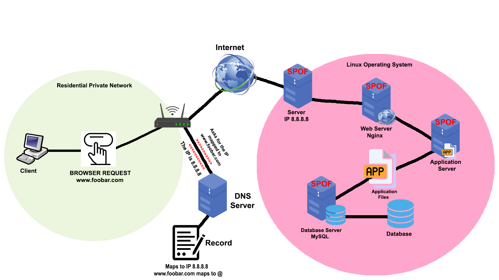

# Simple Web Stack

## Description

This is a Simple Web Stack infrastructure that hosts a website that is reachable via `www.foobar.com`. The domain name is configured with a **www DNS record** pointing to the IP address `8.8.8.8` which corresponds to a single physical or virtual server. This server includes all necessary components to serve a dynamic website: a **web server (Nginx)**, an **application server**, the **application codebase**, and a **MySQL database**.

## Infrastructure Components:

- Domain: foobar.com
- DNS:
  - Record Type: A
  - www.foobar.com → 8.8.8.8
- One server at IP address: 8.8.8.8
  - Web server: Nginx
  - Application server: (e.g., PHP-FPM, Node.js, Gunicorn, etc.)
  - Application files: The website source code
  - Database: MySQL

### Component Roles:

- **Server**: A physical or virtual machine that hosts all services required to run the website.
- **Domain name**: Human-readable name that maps to the IP address of the server.
- **DNS A record (www)**: Maps the subdomain `www` to the server’s IP address.
- **Web server (Nginx)**: Handles HTTP requests, serves static content, and proxies dynamic content to the application server.
- **Application server**: Runs the backend application logic and interacts with the database.
- **Application files**: Source code of the website including frontend and backend logic.
- **Database (MySQL)**: Stores and manages persistent data like users, posts, etc.
- **Communication**: The server communicates with the user’s computer using HTTP/HTTPS over TCP/IP.

### Issues with this architecture:

- **SPOF (Single Point of Failure)**: If the server fails, the entire website goes down.
- **Downtime during maintenance**: Deployments or server restarts cause temporary downtime.
- **Scalability limitations**: One server cannot efficiently handle high volumes of traffic.
