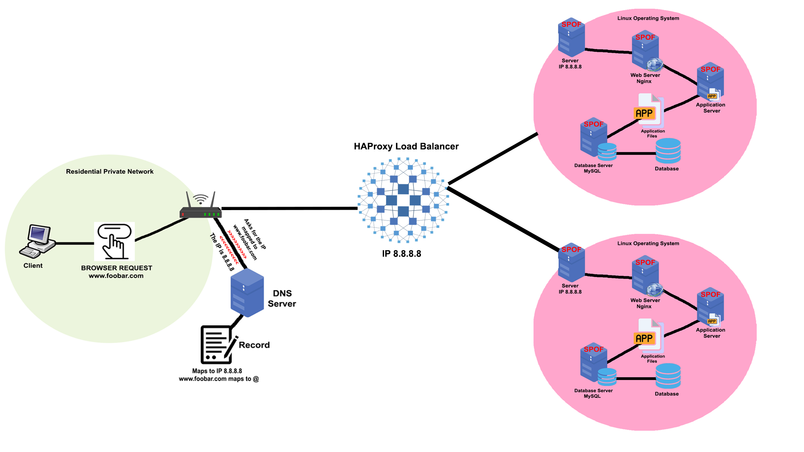

# Distributed web infrastructure

## Description

This image illustrates how a distributed web infrastructure works. It helps reduce the load on the primary server by offloading some of the traffic to a replica server. Additionally, it increases availability by minimizing the impact of both planned and unplanned downtimes.

## Infrastructure Components:

- Domain: foobar.com
- DNS:
  - Record Type: A
  - www.foobar.com → Public IP of the Load Balancer
- Load Balancer: HAProxy
- Two Web Servers (e.g., at IPs 8.8.8.8 and 8.8.4.4):
  - Web server: Nginx
  - Application server: (e.g., PHP-FPM, Node.js, Gunicorn, etc.)
  - Application files: The website source code
  - Database: MySQL

## Specifics about this infrastructure

**Load Balancer (HAProxy)**: Distributes incoming traffic between the two web servers, reducing load and increasing availability. It is configured with a round-robin distribution algorithm, which forwards each incoming request to the next available server in sequence.

**Two Web Servers**: Redundancy ensures the service remains available if one server fails. Both servers run Nginx, an application server, and a copy of the website source code.

**Primary-Replica Database Setup**:

  - **Primary (Master) Node**: Handles all write operations (INSERT, UPDATE, DELETE).

  - **Replica (Slave) Node**: Receives and replicates data changes from the primary node, and can serve read-only queries to reduce load on the primary.

**Active-Active Setup**: Both servers actively handle traffic at the same time. This increases efficiency and minimizes downtime, as the failure of one node doesn't disrupt the service.
(In contrast, an Active-Passive setup would keep one server idle until the active one fails.)

### Component Roles:

- **Server**: A physical or virtual machine that hosts all services required to run the website.
- **Domain name**: Human-readable name that maps to the IP address of the server.
- **DNS A record (www)**: Maps the subdomain `www` to the server’s IP address.
- **HAProxy (Load Balancer)**: Manages traffic routing using a round-robin algorithm.
- **Web servers (Nginx)**: Serve static content and forward dynamic requests to the app server.
- **Application server**: Runs the backend application logic and interacts with the database.
- **Application files**: Source code of the website including frontend and backend logic.
- **Database (MySQL)**: Stores and manages persistent data like users, posts, etc.
- **Communication**: The server communicates with the user’s computer using HTTP/HTTPS over TCP/IP.

### Issues with this architecture:

- **SPOF (Single Point of Failure)**: If the server fails, the entire website goes down.
- **Downtime during maintenance**: Deployments or server restarts cause temporary downtime.
- **No Monitoring**: No health checks, logging, or alerting system in place to detect issues or performance degradation.
