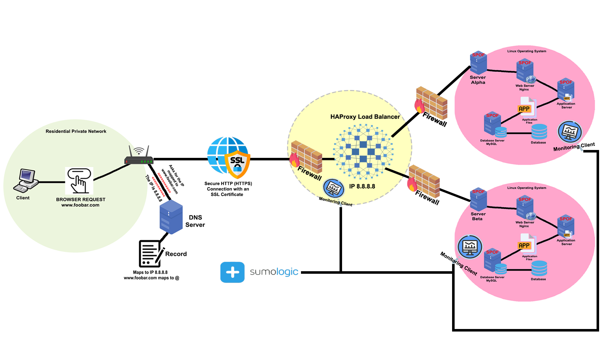

# Secured and monitored web infrastructure

## Description

This image illustrates a secured and monitored distributed web infrastructure that hosts the website www.foobar.com. It improves performance and availability by distributing traffic between two web servers, protects the system with firewalls and encrypted communication (HTTPS), and incorporates monitoring tools to detect and respond to failures or anomalies in real-time.

## Infrastructure Components:

- Domain: foobar.com
- DNS:
  - Record Type: A
  - www.foobar.com → Public IP of the Load Balancer
- SSL Certificate: Installed at the Load Balancer to serve traffic over HTTPS
- Firewalls: Three total, protecting:
    - The Load Balancer
    - The Web/Application Servers
    - The Database Server
- Load Balancer: HAProxy
- Two Web Servers (e.g., at IPs 8.8.8.8 and 8.8.4.4):
  - Web server: Nginx
  - Application server: (e.g., PHP-FPM, Node.js, Gunicorn, etc.)
  - Application files: The website source code
  - Monitoring Client: Installed to collect metrics and logs
  - Database: MySQL

## Specifics about this infrastructure

**SSL Certificate**: Installed on the load balancer to serve encrypted traffic over HTTPS. It ensures that data transmitted between users and the website is encrypted, preventing eavesdropping and tampering. This enhances user trust and secures sensitive information in transit.

**Three Firewalls**:
- Each major component is protected by its own firewall:
    - Firewall 1: Protects the load balancer, allowing only ports 80 (HTTP) and 443 (HTTPS) from the internet.
    - Firewall 2: Protects the application/web servers, allowing only trusted internal traffic (e.g., from the load balancer).
    - Firewall 3: Protects the database server, allowing only internal traffic (e.g., from the application servers) on MySQL port 3306.

**Monitoring Clients**: Installed on each server (web/app/database) to track system metrics, logs, and service health, these clients send data to a centralized monitoring service (SumoLogic in this case).

**Monitoring** is used to detect **failures**, **performance issues**, and **anomalies** in real time, also to monitor web server QPS (queries per second), logs or metrics can be collected from Nginx access logs or application endpoints, then analyzed using the monitoring service to generate dashboards and alerts.

### Component Roles:

- **Server**: A physical or virtual machine that hosts all services required to run the website.
- **Domain name**: Human-readable name that maps to the IP address of the server.
- **DNS A record (www)**: Maps the subdomain `www` to the server’s IP address.
- **HAProxy (Load Balancer)**: Manages traffic routing using a round-robin algorithm.
- **SSL Certificate**: Enables encrypted HTTPS communication between users and the load balancer, protecting data in transit.
- **Firewalls**: Control inbound and outbound network traffic at different layers (load balancer, web servers, database), blocking unauthorized access and reducing exposure to attacks.
- **Web servers (Nginx)**: Serve static content and forward dynamic requests to the app server.
- **Application server**: Runs the backend application logic and interacts with the database.
- **Application files**: Source code of the website including frontend and backend logic.
- **Database (MySQL)**: Stores and manages persistent data like users, posts, etc.
- **Monitoring Clients**: Collect system metrics, logs, and performance data from each server and forward them to a centralized monitoring service.
- **Communication**: The server communicates with the user’s computer using HTTP/HTTPS over TCP/IP.

### Issues with this architecture:

- **SSL Termination at Load Balancer**:
    - Traffic between the load balancer and backend servers may be unencrypted unless re-encryption is configured.
    - This leaves internal traffic potentially vulnerable if the internal network is compromised.
- **Single Writable MySQL Server**:
    - All writes depend on the primary database server.
    - If it fails, write operations are halted unless failover is implemented.
- **Servers with All Components**:
    - Running the web server, app server, and database on the same machine introduces resource contention.
    - Makes scaling and isolation more difficult, and increases blast radius in case of failure.
