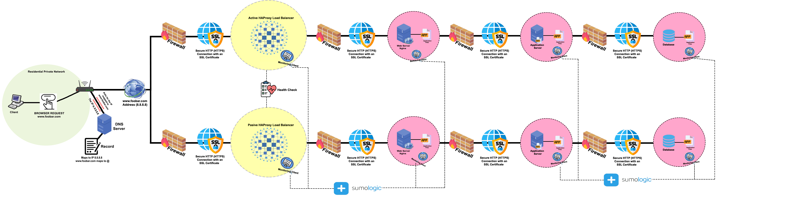

# Scaled Up Web Infrastructure

## Description

This web infrastructure is a secure, high-availability setup with all major components—web, app, and database—on separate servers. It uses active-passive load balancers, end-to-end HTTPS with SSL certificates, and dedicated firewalls for each layer. Monitoring agents send metrics and logs to Sumo Logic for real-time insights and alerting.

## Specifics about this infrastructure

**Addition of firewalls between servers**:
    Firewalls between each server layer provide targeted protection, limiting access to only necessary traffic and reducing exposure to unauthorized users.
### Issues with this architecture:

- **Increased operational expenses** :
    Separating each major component into its own dedicated server leads to **higher infrastructure costs**. This approach requires the purchase of **additional hardware** and results in **increased power consumption**. As a result, the company would need to allocate more budget to cover both the initial investment in new servers and the ongoing electricity expenses required to keep all systems—both new and existing—running continuously.